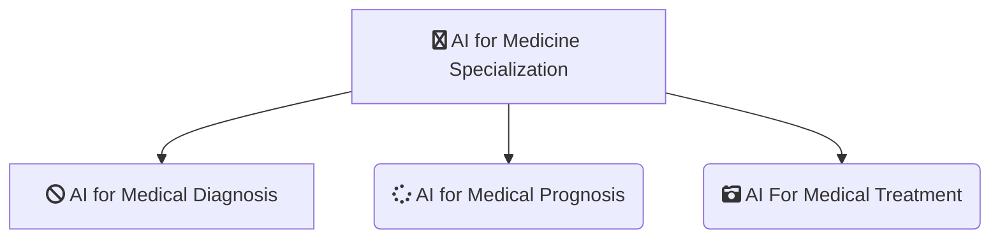

-------------------------------------------------------------------------------------------

-------------------------------------------------------------------------------------------

# [DeepLearning.AI - AI FOR MEDICINE SPECIALIZATION](https://www.coursera.org/specializations/ai-for-medicine)
*This Repository Contains Solution to the Assignments of the AI for Medicine Specialization from Deeplearning.ai on Coursera Taught by 
[Pranav Rajpurkar](https://www.coursera.org/instructor/pranav-rajpurkar),
[Bora Uyumazturk](https://www.coursera.org/instructor/bora-uyumazturk),
[Amirhossein Kiani](https://www.coursera.org/instructor/amirhossein-kiani),
[Eddy Shyu](https://www.coursera.org/instructor/eddy-shyu)*

-------------------------------------------------------------------------------------------

## WHAT YOU WILL LEARN

-Diagnose diseases from x-rays and 3D MRI brain images.
-Predict patient survival rates more accurately using tree-based models.
-Estimate treatment effects on patients using data from randomized trials.
-Automate the task of labeling medical datasets using natural language processing.

---

## About this Specialization

AI is transforming the practice of medicine. It’s helping doctors diagnose patients more accurately, make predictions about patients’ future health, and recommend better treatments. This three-course Specialization will give you practical experience in applying machine learning to concrete problems in medicine.

These courses go beyond the foundations of deep learning to teach you the nuances in applying AI to medical use cases. 

---

## Applied Learning Project
Medicine is one of the fastest-growing and important application areas, with unique challenges like handling missing data. You’ll start by learning the nuances of working with 2D and 3D medical image data. You’ll then apply tree-based models to improve patient survival estimates. You’ll also use data from randomized trials to recommend treatments more suited to individual patients. Finally, you’ll explore how natural language extraction can more efficiently label medical datasets.

-------------------------------------------------------------------------------------------------------------

## There are 3 Courses in this Specialization

### COURSE 1
### AI for Medical Diagnosis

In the first course of the AI for Medicine Specialization, you will:
- You will practice classifying diseases on chest x-rays using a neural network.
- You will practice implementing standard evaluation metrics to see how well a model performs in diagnosing diseases.
- You will prepare 3D MRI data, implement an appropriate loss function for image segmentation, and apply a pre-trained U-net model to segment tumor regions in 3D brain MRI images.

* [AI for Medical Diagnosis](https://github.com/shantanu1109/Coursera-DeepLearning.AI-AI-FOR-MEDICINE-SPECIALIZATION/tree/main/Course-1-AI%20for%20Medical%20Diagnosis)

### COURSE 2
### AI for Medical Prognosis

In the second course of the AI for Medicine Specialization, you will:
- Walk through examples of prognostic tasks.
- Apply tree-based models to estimate patient survival rates.
- Navigate practical challenges in medicine like missing data. 

* [AI for Medical Prognosis](https://github.com/shantanu1109/Coursera-DeepLearning.AI-AI-FOR-MEDICINE-SPECIALIZATION/tree/main/Course-2-AI%20for%20Medical%20Prognosis)

### COURSE 3
### AI For Medical Treatment
In the third course of the AI for Medicine Specialization, you will:
- Estimate treatment effects using data from randomized control trials
- Explore methods to interpret diagnostic and prognostic models
- Apply natural language processing to extract information from unstructured medical data

* [AI For Medical Treatment](https://github.com/shantanu1109/Coursera-DeepLearning.AI-AI-FOR-MEDICINE-SPECIALIZATION/tree/main/Course-3-AI%20For%20Medical%20Treatment)

-------------------------------------------------------------------------------------------------------------

## Certificate

1. [AI for Medical Diagnosis](https://www.coursera.org/account/accomplishments/certificate/FVE3F7MAHFY9)
2. [AI for Medical Prognosis](https://www.coursera.org/account/accomplishments/certificate/DTCL25KGDUMF)
3. [AI for Medical Treatment](https://www.coursera.org/account/accomplishments/certificate/22MZ6RTJHQ3C)
4. [AI for Medicine Specialization (Final Certificate)](https://www.coursera.org/account/accomplishments/specialization/certificate/ZDHX94KGVZ7Q)

--------------------------------------------------------------------------------------------------------------

## References
1. [AI for Medical Diagnosis](https://www.coursera.org/learn/ai-for-medical-diagnosis?specialization=ai-for-medicine)
2. [AI for Medical Prognosis](https://www.coursera.org/learn/ai-for-medical-prognosis?specialization=ai-for-medicine)
3. [AI For Medical Treatment](https://www.coursera.org/learn/ai-for-medical-treatment?specialization=ai-for-medicine)

----------------------------------------------------------------------------------------------------------------

## 📝 Disclaimer 
I made this repository as *a reference*. Please do not copy paste the solution as is. You can find the solution if you read the instruction carefully. 

 
## 📝 License
The gem is available as open source under the terms of the [MIT License](https://opensource.org/licenses/MIT).
 
-----------------------------------------------------------------------------------------------------------------
